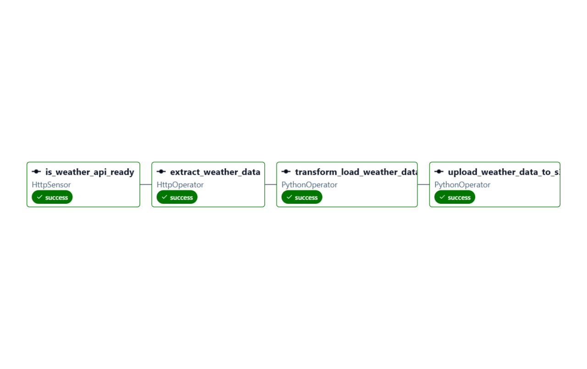
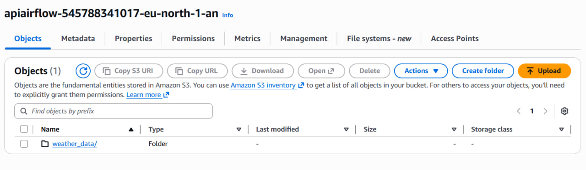

# 🌦️ Weather ETL Pipeline on AWS with Airflow

<p align="center">
  
  
  
  
</p>

<p align="center">
  <b>A data engineering project that builds and orchestrates an end-to-end ETL pipeline using Python, Apache Airflow, AWS EC2, and AWS S3.</b>
</p>

---

## 📌 Overview

This project demonstrates how to build a small **production-style ETL pipeline** that:

- **Extracts** weather data from the **OpenWeatherMap API**
- **Transforms** raw JSON data into a structured tabular format
- **Loads** the processed data:
  - locally as a **CSV** file
  - remotely into an **AWS S3 bucket**
- **Runs on an AWS EC2 instance**
- **Uses Apache Airflow** to orchestrate the workflow as a DAG
- **Uses VS Code Remote SSH** to develop directly on the cloud server
- **Accesses the Airflow web UI** locally through SSH port forwarding

This project combines **Python scripting**, **workflow orchestration**, **cloud deployment**, and **remote development** into one project.

---

## 🚀 Project Architecture

```text
OpenWeatherMap API
        │
        ▼
   Extract Task
        │
        ▼
 Transform Task
        │
        ▼
    Load Task
   ┌───────────────┬───────────────┐
   ▼               ▼               │
Local CSV      AWS S3 Bucket       │
                                Airflow DAG
                                     │
                                     ▼
                           Running on AWS EC2
                                     │
                                     ▼
                    VS Code Remote SSH + Airflow UI
```

---

## 🧰 Tech Stack
- Python
- Apache Airflow
- AWS EC2
- AWS S3
- OpenWeatherMap API
- Pandas
- Boto3
- VS Code Remote SSH

---

## ✨ Key Features

- End-to-end ETL pipeline (Extract, Transform, Load)
- API ingestion from OpenWeatherMap
- Workflow orchestration with Apache Airflow
- Cloud deployment on AWS EC2
- Data storage in AWS S3 and local CSV
- Containerized environment using Docker
- Secure credential management with Airflow Variables
- Remote development via VS Code SSH

--- 

## 📂 Repository Structure
```bash
weather_ETL_pipeline/
│
├── dags/
│   └── weather_etl_dag.py
│
├── include/
│   └── weather_pipeline/
│       ├── transform.py
│       └── load.py
│   ├── __init__.py
│
├── data/
│   └── weather_data.png
│
├── docker/
│   ├── Dockerfile
│
├── screenshots/
│   ├── project_structure(airflow UI).png
│   ├── output_file.png
│   └── s3_upload.png
│
├── requirements.txt
├── .gitignore
├── LICENSE
└── README.md

```

---
## 🔄 ETL Workflow
### 1. Extract

The pipeline sends a request to the OpenWeatherMap API and retrieves weather data in JSON format.

Example extracted information:

- city name
- temperature
- humidity
- pressure
- weather description
- timestamp
### 2. Transform

The raw response is cleaned and transformed into a structured dataset.

Typical transformations include:

- selecting relevant fields
- renaming columns
- converting data types
- formatting timestamps
- creating a CSV-ready table
### 3. Load

The final processed data is stored in two destinations:

- Locally on the EC2 instance as a .csv file
- AWS S3 as a cloud-stored CSV object

---
## ⚙️ Airflow Orchestration

This project uses Apache Airflow to define the ETL process as a DAG.

The DAG manages:

- task dependencies
- workflow execution
- retries and scheduling
- monitoring through the Airflow UI

DAG stages:

- API check / extraction
- transformation
- local save
- S3 upload
---

## ☁️ AWS Deployment

The pipeline runs on an AWS EC2 instance, making the project closer to a real cloud workflow.

EC2 is used for:
- hosting the Airflow environment
- executing the ETL pipeline
- storing the generated local CSV output
- enabling remote development with SSH
S3 is used for:
- storing the transformed CSV output
- simulating a cloud-based data lake / storage layer

--- 

## 💻 Remote Development with VS Code SSH

To work directly on the EC2 instance, the project uses VS Code Remote SSH.

This allows:

- editing files directly on the server
- running Airflow remotely
- managing the project without manually copying files back and forth

---

## 🌐 Accessing the Airflow UI

Since Airflow runs on the EC2 instance, its web interface can be accessed locally using SSH port forwarding.

Example: 
```bash
ssh -i your-key.pem -L 8080:localhost:8080 ec2-user@your-ec2-public-ip
```

Then open in your browser:
```bash
http://localhost:8080
```
This makes it possible to view and manage DAGs from your own machine while Airflow is running remotely. 

--- 

## 🛠️ Installation & Setup
### 1. Clone the repository
 ```bash
git clone https://github.com/your-username/weather-etl-pipeline.git
cd weather-etl-pipeline
 ```
### 2. Create a virtual environment
```bash 
python -m venv venv
source venv/bin/activate 
```
### 3. Install dependencies
```bash
pip install -r requirements.txt
```
### 4. Set environment variables

You will need credentials for:

- OpenWeatherMap API
- AWS access
- AWS region
- S3 bucket

Example:
```bash
export OPENWEATHER_API_KEY="your_api_key"
export AWS_ACCESS_KEY_ID="your_access_key"
export AWS_SECRET_ACCESS_KEY="your_secret_key"
export AWS_DEFAULT_REGION="your_region"
export S3_BUCKET_NAME="your_bucket_name"
``` 

### 5. Start Airflow (on your EC2 instance)
```bash 
airflow standalone
```

### 6. Trigger the DAG
Open the Airflow UI and run the ETL DAG.

---

## 🔐 Airflow Variables & Connections

To improve security and follow best practices, sensitive data is managed using **Airflow Variables and Connections** instead of hardcoding them.

### 📌 Variables Used

| Variable Name | Description |
|--------------|------------|
| `OPENWEATHER_API_KEY` | API key for OpenWeatherMap |
| `S3_BUCKET_NAME` | Target S3 bucket |

---

### ⚙️ Setting Variables in Airflow

You can define variables via:

#### Option 1 — Airflow UI
- Go to **Admin → Variables**
- Add key-value pairs

#### Option 2 — CLI

```bash
airflow variables set OPENWEATHER_API_KEY your_key
airflow variables set S3_BUCKET_NAME your_bucket
```

--- 
## 📊 Example Output

The pipeline produces a structured CSV dataset containing processed weather information.

Example columns:

- city
- temperature
- humidity
- pressure
- weather_description
- timestamp

The output is stored:

- in the local data/ folder
- in the configured AWS S3 bucket

---

## 🐳 Docker Setup

This project can be fully containerized using Docker, allowing you to run Airflow and the ETL pipeline in an isolated and reproducible environment.

### 📦 Docker Components

- **Dockerfile** → Defines the Airflow + Python environment
- **docker-compose.yml** → Orchestrates Airflow services (webserver, scheduler)

---

### 🚀 Run with Docker

```bash
cd docker
docker-compose up --build
```
This will start:

- Airflow Webserver
- Airflow Scheduler

Then open:
```bash
http://localhost:8080
```

---
## 🖼️ Screenshots

### Project Structure (Airflow UI)


### S3 Upload Result


--- 
## 📈 Learning Outcomes

Through this project, I practiced:

- building modular ETL pipelines in Python
- working with REST APIs
- orchestrating workflows with Apache Airflow
- deploying projects on AWS EC2
- storing outputs in AWS S3
- connecting remotely to cloud infrastructure using SSH
- accessing remote web applications locally through port forwarding

--- 
## 🔮 Future Improvements

This project can be extended in several directions to better reflect real-world data engineering systems:

### 🔄 Pipeline Enhancements
- Support multiple cities and batch data ingestion
- Add incremental data loading instead of full refresh
- Introduce data validation checks (e.g., missing/null values, schema enforcement)
- Implement retry logic and failure notifications in Airflow

### 📊 Data Storage & Modeling
- Store historical data instead of overwriting CSV files
- Partition data in S3 by date (e.g., `year/month/day`)
- Introduce a data warehouse layer (e.g., Snowflake, BigQuery, Redshift)
- Apply a Medallion Architecture (Bronze → Silver → Gold)

### ⚙️ Orchestration & Scalability
- Schedule DAG runs (hourly/daily pipelines)
- Use Airflow sensors for smarter dependency handling
- Scale Airflow using CeleryExecutor or KubernetesExecutor
- Separate environments (dev / staging / production)

### 🔐 Security & Configuration
- Move secrets to AWS Secrets Manager or Parameter Store
- Use IAM roles instead of static AWS credentials
- Improve configuration management using environment-based configs

### 🐳 DevOps & Deployment
- Fully dockerize the project with multi-container setup
- Add CI/CD pipeline (GitHub Actions) for testing and deployment
- Automate infrastructure setup using Terraform
- Deploy Airflow on a managed service (e.g., MWAA)

### 📈 Monitoring & Observability
- Add structured logging
- Integrate monitoring tools (e.g., Prometheus, Grafana)
- Track pipeline metrics and failures
- Add alerting (email/Slack notifications)

### 🧪 Testing & Code Quality
- Add unit tests for ETL functions
- Introduce data quality tests (e.g., Great Expectations)
- Apply linting and formatting (flake8, black)
- Improve documentation and docstrings

### 🤖 Advanced Extensions
- Stream data instead of batch processing (Kafka / Kinesis)
- Build a simple dashboard (Streamlit / Dash) on top of the data
- Integrate ML models for weather prediction or anomaly detection
---
## 📜 License
This Project is licensed under the MIT license.

--- 


